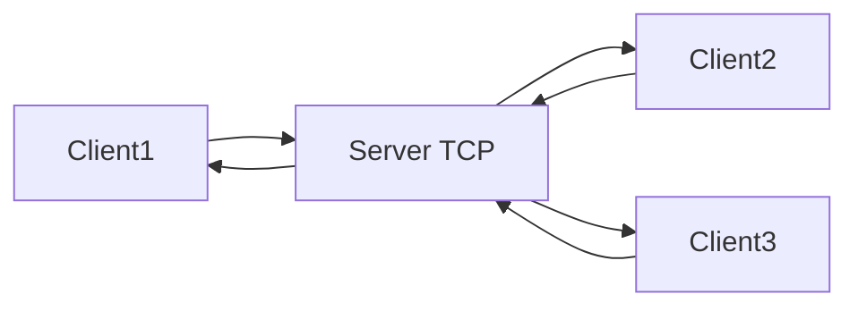

# TCP Communication Project

This project implements a TCP server and client that communicate with each other on the same machine (localhost). The server supports multiple clients simultaneously using threads, and each client can send messages, receive responses, and disconnect gracefully with the `DISCONNECT` command.

## Requirements

- Python 3.x installed on your machine.

## Included Files

- `server.py`: The TCP server that waits for client connections.
- `client.py`: The TCP client that connects to the server and sends messages.
- `Run_Server.bat`: Optional script to run the server on Windows.
- `Run_Client.bat`: Optional script to run the client on Windows.

## How to Use

### 1. Initial Setup
Make sure Python is installed on your system. If not, you can download it from [python.org](https://www.python.org/downloads/).

### 2. Run the Server
1. Open a terminal or command prompt.
2. Navigate to the folder containing `server.py` and `Run_Server.bat`.
3. Run the server with:

## python server.py

or using the Window script:

## Run_Server.bat

4. The server will start listening for connections on port `5000` at `localhost`.

### 3. Run the Client
1. Open another terminal or command prompt.
2. Navigate to the folder containing `client.py` and `Run_Client.bat`.
3. Run the client with:

## python client.py

or using the Window script:

## Run_Client.bat

4. The client will ask you to enter a message to send to the server:  
`Enter the message to send to the server (or 'DISCONNECT' to exit):`
5. To close the connection, type `DISCONNECT`.

## Example Execution

**Server**

```
========================================================
[SERVER] LISTENING ON localhost::5000...
========================================================

[NEW CONNECTION] ('127.0.0.1', 50532)
CLIENT ('127.0.0.1', 50532): hello
CLIENT ('127.0.0.1', 50532): disconnect
[CLOSED CONNECTION] ('127.0.0.1', 50532)
```

**Client**

```
============================
YOU ARE CONNECTED TO THE SERVER TCP...
============================

INPUT A MESSAGE TO THE SERVER ('DISCONNECT' TO CLOSE COMMUNICATION):
hello
SERVER ANSWER: HELLO

INPUT A MESSAGE TO THE SERVER ('DISCONNECT' TO CLOSE COMMUNICATION):
disconnect
SERVER ANSWER: CLOSING CONNECTION...
CLOSE CONNECTION...
COMMUNICATION WITH THE SERVER WAS DISCONNECTED....
```



---

## Author

### Luis Nava | [LuisNava2001](https://github.com/LuisNava2001)

> I'm exploring and sharing practical Python projects to simplify daily tasks.  
> Feel free to fork this repo, suggest improvements, or open issues!

---


